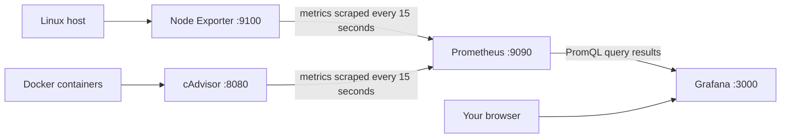

# Monitor the Linux host and Docker containers

## 1. Understand the four services



An **exporter** reads resource statistics and serves them as named measurements at
`/metrics`. Prometheus periodically requests those measurements (a **scrape**) and
stores timestamped samples. Grafana queries Prometheus and draws the results.
Grafana itself does not collect CPU or memory measurements.

| Service | What it does | Data location |
| --- | --- | --- |
| `node-exporter` | Reads Linux CPU, memory, load, filesystem and disk statistics | Host `/proc`, `/sys`, and filesystems |
| `cadvisor` | Reads resource usage for Docker containers, including the shop and monitoring services | Host cgroups and Docker metadata |
| `prometheus` | Scrapes both exporters and itself every 15 seconds | `prometheus-data` volume |
| `grafana` | Serves dashboards and stores users/settings | `grafana-data` volume |

The four services use the optional `monitoring` Compose profile. Ordinary
`docker compose up -d` still starts the seven application services. Enabling the
profile starts eleven services in total. The monitoring services have their own
Docker network; cAdvisor observes application containers through host mounts, so
it does not need to join the application network.

This is resource monitoring. It does not measure GraphQL latency, HTTP error rates,
PostgreSQL queries, RabbitMQ queue depth, or Celery task outcomes. Those require
application instrumentation or service-specific exporters. It also does not
collect logs or send alert notifications.

## 2. Check the host prerequisites

Run from the repository root:

```bash
docker version
docker compose version
docker info --format '{{.DockerRootDir}}'
test -c /dev/kmsg
test -d /dev/disk
```

Use a native Linux host with a rootful Docker Engine and Compose v2. cAdvisor uses
the host cgroup namespace and `/dev/kmsg`. Docker Desktop measures its Linux VM,
not the physical macOS/Windows host; rootless Docker and restricted containers may
not permit these mounts. The configured Docker data directory is `/var/lib/docker`.
If `DockerRootDir` differs, change the cAdvisor data-directory mount to expose that
actual absolute path at the same path inside cAdvisor before starting it.

Node Exporter reads the host root at `/host` with `ro,rslave`: read-only access,
with host mount changes propagated into the container. Its rootfs, procfs and sysfs
flags point to that tree. `pid: host` provides host process visibility. Network
namespace collectors are disabled because the exporter uses a Docker bridge
network; the included network panels deliberately use cAdvisor's per-container
metrics. The filesystem exclusion skips virtual trees and Docker internals.

cAdvisor has `privileged: true`, host cgroup access, and read-only mounts of `/`,
`/sys`, `/var/run`, `/var/lib/docker`, and `/dev/disk`. These support container
identification and resource collection. This is broad host access: a read-only
socket mount does **not** make Docker API calls read-only. Run this only on a host
where you trust the monitoring image. The mount layout follows the
[upstream cAdvisor deployment](https://github.com/google/cadvisor#quick-start-running-cadvisor-in-a-docker-container).

Only Compose project/service labels are retained, reducing unnecessary metadata
and the number of unique time series. cAdvisor can still see containers belonging
to other projects on this host. The dashboard's project selector filters the
container panels; host panels always describe the whole host.

## 3. Add the Grafana password to Infisical

In the same Infisical project, environment and secret path used for the shop, add:

```text
GRAFANA_ADMIN_PASSWORD
```

Use a unique password. Keep the existing three application secrets present, then:

```bash
SYNC_MONITORING_SECRETS=true ./docker/sync-infisical-secrets.sh
test -s .secrets/grafana_admin_password
```

The flag makes the sync script require the fourth key before writing any secret
files. It writes the password to the ignored `.secrets/grafana_admin_password`.
Without the flag, the script keeps its existing three-secret behavior. The flag
must be passed to the shell command; adding it to `.env` alone does not export it
to this script. You may instead set it in `.infisical/config.env`, which the script
sources. Only the exact values `true` and `false` are accepted.

Compose mounts this file only into Grafana at
`/run/secrets/grafana_admin_password`. `GF_SECURITY_ADMIN_PASSWORD__FILE` tells
Grafana to read it. The local cache uses the project's existing permissions:
mode 700 on the containing directory, mode 644 on individual files so non-root
container users can read their mounts. Never commit real credentials or use the
example password. Grafana's
[Docker configuration documentation](https://grafana.com/docs/grafana/latest/setup-grafana/configure-docker/)
explains the file-based setting.

## 4. Review ports and start

Optional non-secret settings in `.env`:

```dotenv
PROMETHEUS_PORT=9090
GRAFANA_PORT=3000
GRAFANA_ADMIN_USER=admin
```

Both ports bind to `127.0.0.1`. Node Exporter and cAdvisor have no host-published
ports. Service-to-service traffic uses the fixed internal ports and Docker DNS
names, so changing a host port does not require editing the scrape configuration.

Validate and launch the complete stack:

```bash
docker compose --profile monitoring config --quiet
docker compose --profile monitoring pull prometheus grafana node-exporter cadvisor
docker compose --profile monitoring up -d --build
```

`config --quiet` checks Compose structure/interpolation without printing resolved
configuration. `pull` downloads the pinned monitoring images. `up -d --build`
builds the application if needed and starts the selected services in the
background. To add monitoring to an already running shop without rebuilding it:

```bash
docker compose --profile monitoring up -d prometheus grafana node-exporter cadvisor
```

`depends_on` orders creation; it does not prove that exporters are ready. Initial
scrapes can fail briefly while services start. Check readiness explicitly below.

## 5. Verify collection before reading dashboards

```bash
docker compose --profile monitoring ps
curl --fail http://127.0.0.1:9090/-/ready
curl --fail http://127.0.0.1:3000/api/health
curl --fail http://127.0.0.1:9090/api/v1/targets
```

Substitute your configured host ports if changed. Prometheus should report ready;
Grafana should report its database as `ok`. Open
[Prometheus targets](http://localhost:9090/targets): the `prometheus`,
`node-exporter`, and `cadvisor` targets should all be **UP** after about 30 seconds.

In the Prometheus query page, run each expression:

```promql
up
node_memory_MemTotal_bytes{job="node-exporter"}
container_memory_working_set_bytes{job="cadvisor",image!=""}
```

`up` should contain three series with value 1. The second query should return the
host's total RAM in bytes. The third should return named Docker containers; merely
seeing `cadvisor` UP does not establish that it successfully discovered containers.
Check the labels for `container_label_com_docker_compose_project` and
`container_label_com_docker_compose_service`.

## 6. Open the preconfigured Grafana dashboard

Visit [Grafana](http://localhost:3000), log in as `admin` (or your configured user)
with the Infisical password, then open **Dashboards → Infrastructure → Shop — Host
and Containers**. Its direct path is `/d/shop-infrastructure`.

The datasource provisioning file creates a default Prometheus datasource with UID
`prometheus` and URL `http://prometheus:9090`. Here `localhost` would mean the
Grafana container itself, so the Docker service name is essential. The dashboard
provider loads the committed JSON every 30 seconds. You do not need to import an
external dashboard or manually add a datasource. This uses Grafana's
[file provisioning](https://grafana.com/docs/grafana/latest/administration/provisioning/).

Choose your Compose project in the dashboard selector. `All` includes every Docker
project visible to cAdvisor. The time range starts at the last hour and refreshes
every 15 seconds. Allow at least two scrapes for rate panels to appear and about
five minutes for the complete averaging window.

| Panel | Interpretation |
| --- | --- |
| Scrape targets | 1 means the exporter answered; 0 means a scrape failed. This is not application health. |
| Host CPU busy | Percentage averaged across all host cores over five minutes. |
| Host memory used | Total minus available memory; available includes reclaimable caches. |
| Host filesystem used | Space unavailable to ordinary users, including reserved space. Each mount is separate. |
| Host load | Tasks running/waiting for CPU or in uninterruptible sleep; compare with CPU core count. |
| Host disk throughput | Reads plus writes per second, per device; layered devices can represent the same I/O. |
| Container CPU | 100% means one full CPU core; 250% means approximately 2.5 cores. |
| Container working set | Memory after subtracting inactive file cache; not identical to RSS or a limit percentage. |
| Container network | Received/transmitted bytes per second across non-loopback interfaces. |

## 7. Understand the queries

Prometheus labels identify the source of each series. `job="cadvisor"` selects the
container exporter; `name` identifies a container. A **counter** accumulates over
time, while a **gauge** is a current value such as memory usage.

For host CPU, the dashboard uses:

```promql
100 * (1 - avg by (instance) (
  rate(node_cpu_seconds_total{job="node-exporter",mode="idle"}[5m])
))
```

`rate(...[5m])` calculates idle seconds per second over five minutes and handles
counter resets. Averaging across cores gives the idle fraction of the host.
Subtracting from 1 gives its busy fraction; multiplying by 100 gives a percentage.

For container CPU, it rates `container_cpu_usage_seconds_total`, sums by container
name, and multiplies by 100. Unlike the host query, it does not average across host
cores. Memory uses the current gauge directly. Network counters need `rate` to
convert accumulated bytes into bytes per second. See the
[Node Exporter guide](https://prometheus.io/docs/guides/node-exporter/) for host metric examples.

## 8. Storage, edits, and password rotation

Prometheus retains up to 15 days or approximately 5 GB of stored blocks, whichever
limit is reached first. The write-ahead log and active data require additional
space; 5 GB is not a hard container disk quota. Grafana's volume stores its user
database and settings. Container recreation preserves both named volumes.

Edit `docker/monitoring/prometheus.yml` to change scraping, then:

```bash
docker compose --profile monitoring exec prometheus promtool check config /etc/prometheus/prometheus.yml
docker compose --profile monitoring restart prometheus
```

Edit the committed dashboard JSON to persist dashboard changes. UI saves are
disabled for this provisioned dashboard; create a copy in Grafana if you want to
experiment. Datasource/provider configuration changes require a Grafana restart:

```bash
docker compose --profile monitoring restart grafana
```

The Infisical admin password initializes a **new** Grafana database. Changing that
secret and restarting an initialized Grafana does not reset the existing account.
Change the account password through Grafana's account UI and update Infisical to
match, then sync and recreate Grafana to refresh its mounted secret snapshot:

```bash
SYNC_MONITORING_SECRETS=true ./docker/sync-infisical-secrets.sh
docker compose --profile monitoring up -d --force-recreate grafana
```

To stop only monitoring while preserving data:

```bash
docker compose --profile monitoring stop grafana prometheus node-exporter cadvisor
```

Avoid `docker compose down -v`: it deletes named volumes, including the shop's
PostgreSQL, Redis and RabbitMQ data as well as monitoring history.

## 9. Troubleshooting and remote access

```bash
docker compose --profile monitoring logs --tail=100 prometheus grafana node-exporter cadvisor
```

- **Missing password file:** add the Infisical key and sync with the monitoring flag.
- **Grafana login fails after rotation:** its stored user password is independent
  of the startup secret after initialization; follow step 8.
- **Target DOWN:** inspect its Last Error on `/targets`, then inspect exporter logs.
  Look for permission failures, missing host paths or scrape timeouts.
- **cAdvisor UP but no named containers:** check Docker socket access, Docker data
  path, cgroup support, and cAdvisor logs. Compare with `docker stats --no-stream`.
- **Empty container panels:** reset the project selector to All and run the raw
  container query from step 5. Check that Compose labels exist; wait for two scrapes.
- **Port already allocated:** choose a different host port in `.env` and recreate
  the affected service with `up -d`.
- **Filesystem panels differ from expectations:** compare with `df -h` on the Docker
  host, accounting for excluded virtual filesystems and reserved space.

On a remote server, forward the localhost interfaces through SSH:

```bash
ssh -L 3000:127.0.0.1:3000 -L 9090:127.0.0.1:9090 user@server
```

Then open the local URLs in your browser. Prometheus has no authentication in this
setup. If publishing beyond localhost, provide an authenticated TLS reverse proxy
and restrict exporter access. Dashboard contents expose host/container metadata.
